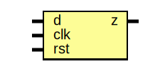
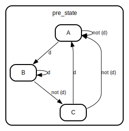

# Entity: Mealy_101_seq_NO 
- **File**: Mealy_101_seq_NO.v

## Diagram

## Ports

| Port name | Direction | Type | Description |
| --------- | --------- | ---- | ----------- |
| d         | input     |      |             |
| clk       | input     |      |             |
| rst       | input     |      |             |
| z         | output    |      |             |

## Signals

| Name      | Type      | Description |
| --------- | --------- | ----------- |
| pre_state | reg [1:0] |             |
| nxt_state | reg [1:0] |             |

## Constants

| Name | Type | Value | Description |
| ---- | ---- | ----- | ----------- |
| A    |      | 2'b00 |             |
| B    |      | 2'b01 |             |
| C    |      | 2'b10 |             |

## Processes
- unnamed: ( @(negedge clk) )
  - **Type:** always

## State machines

